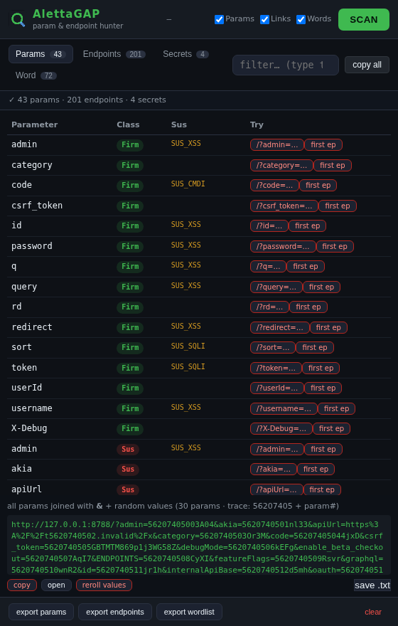
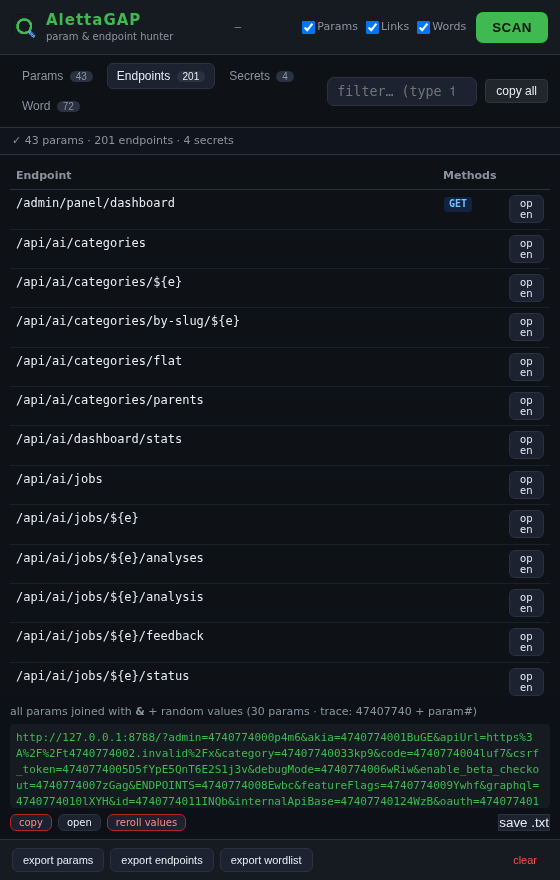
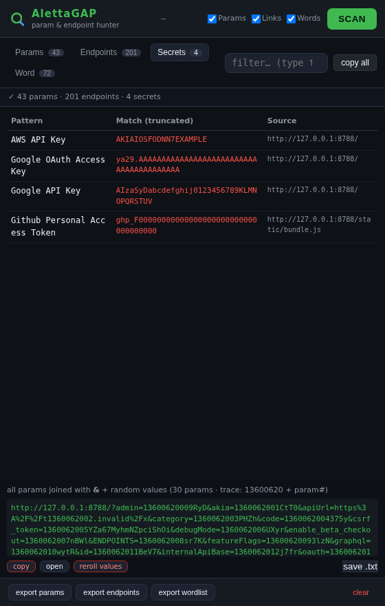

# AlettaGAP

**Parameter & Endpoint Hunter** — a browser extension (Chrome MV3 + Firefox MV2) for *authorized* web security assessments. It watches the pages you visit and mines their HTML/JS bundles for hidden parameters, API endpoints (with HTTP methods), secrets and wordlists — then builds ready-to-fuzz URLs with **traceable random values**.



## Why

Manual recon on SPA/Next.js targets wastes time on things a browser already knows. AlettaGAP does the job of tools like *Get All Parameters* / *fallparams* inside the browser: no proxy setup, no CLI — open the site, hit **Scan**, get harvest you can act on immediately.

## Features

| | |
|---|---|
| 🔎 **Params tab** | Query/body parameter names from pages, JS, forms, source maps — plus **fallparams-style promotion**: query keys found inside endpoint URLs (e.g. `?token=*** `/v2?{page,size}`) become real Params entries. Each param is classified (GAP wordlist classes) and flagged `sus` when it smells like cmd injection / debug / authz / redirect. |
| 🧭 **Endpoints tab** | Framework-agnostic path extraction: plain strings, `fetch()`/`axios`/`XHR`/http-client **call sites with per-endpoint HTTP method badges**, Next.js RSC `apiPaths` objects, Django (`<int:pk>`), Vue/Nuxt template literals, and more. Noise-filtered (assets, `data:`/`mailto:` URIs). |
| 🕵️ **Secrets tab** | 82 regex patterns (AWS, GitHub/GitLab tokens, JWT, Stripe, Slack, private keys…) with source attribution. |
| 📚 **Words tab** | Wordlist export harvested from routes/params/identifiers — feeds directly into your fuzzer. |
| 🎯 **Traceable fuzz values** | The bottom box `&`-joins every harvested param into one URL with random values shaped `nonce + 2-digit-param-index + tail` (e.g. `token=***` for param #12). Fire it once, **grep the nonce in the response** to find reflected input (XSS/SQLi) — and the index tells you *which* param reflected it. |
| 📋 **GAP-style copy** | `copy all` per tab, per-row copy, `copy` / `open` / `reroll` / `save .txt` on the join box. |
| ⚙️ **Modes** | Toggle Params / Links / Words collection depth; filter box per tab; re-scan or reset anytime. |

### Endpoint + Methods, at a glance



### Secrets



## Install

### Chrome / Brave / Edge (MV3)
1. Download [`AlettaGAP-chrome.zip`](releases/AlettaGAP-chrome.zip) and unzip to a folder.
2. Open `chrome://extensions`, enable **Developer mode**.
3. Click **Load unpacked** → select the `chrome/` folder.
4. Pin the icon; open a target site, click the side-panel **Scan**.

### Firefox (MV2)
*Option A — temporary add-on:*
1. Unzip [`AlettaGAP-firefox.zip`](releases/AlettaGAP-firefox.zip).
2. `about:debugging#/runtime/this-firefox` → **Load Temporary Add-on** → pick `firefox/manifest.json`.

*Option B — signed XPI:* [`AlettaGAP-firefox.xpi`](releases/AlettaGAP-firefox.xpi) works in Firefox ESR/DevEdition/Nightly with `xpinstall.signatures.required=false`, or after self-signing via [addons.mozilla.org](https://addons.mozilla.org/developers/) (unlisted).

## Typical workflow

1. Browse the app (login, click around) so more chunks/requests land in history.
2. **Scan** — panel shows counts per tab.
3. Check **Endpoints + method badges** for unauth-able surfaces; check **Params** for hidden fields (`sus` first).
4. Hit **copy** (or *save .txt*) on the bottom join box → replay the single URL with your proxy/SQLi/XSS payloads. The `trace:` nonce shown next to the count is your grep key.
5. **Words** → dump straight into `ffuf`/param spider.

## Layout

```
chrome/    Chrome MV3 build (manifest v3, service worker, side panel)
firefox/   Firefox MV2 build (background script, panel window)
docs/      screenshots used by this README
releases/  ready-to-use zips/xpi
```

## Disclaimer

For **authorized** security testing only (your own apps, or engagements with written permission). Using this against systems without permission is illegal. The authors accept no liability for misuse.

## License

MIT
